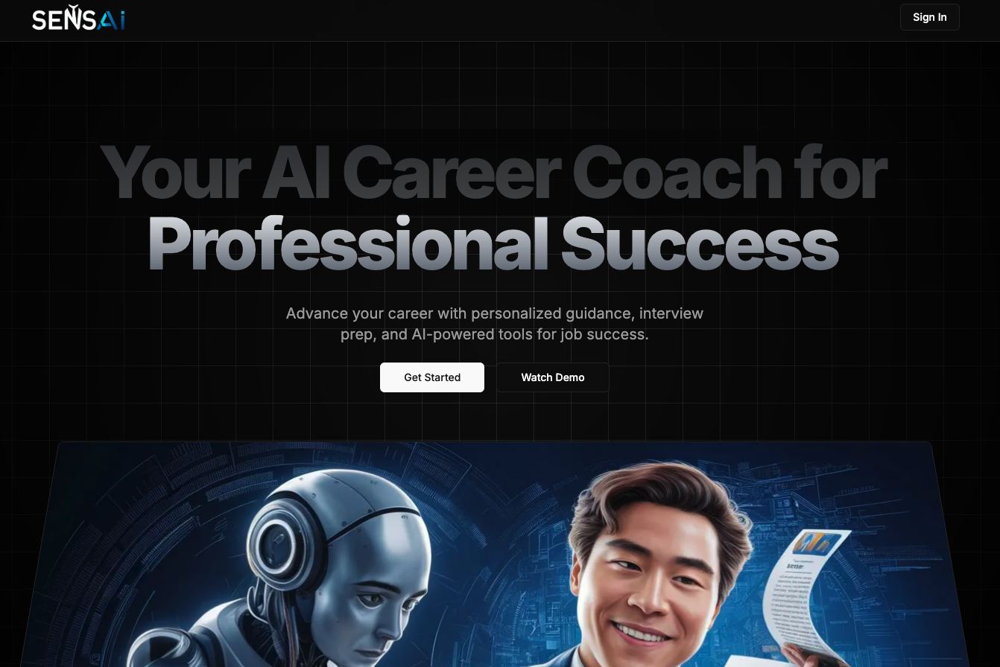
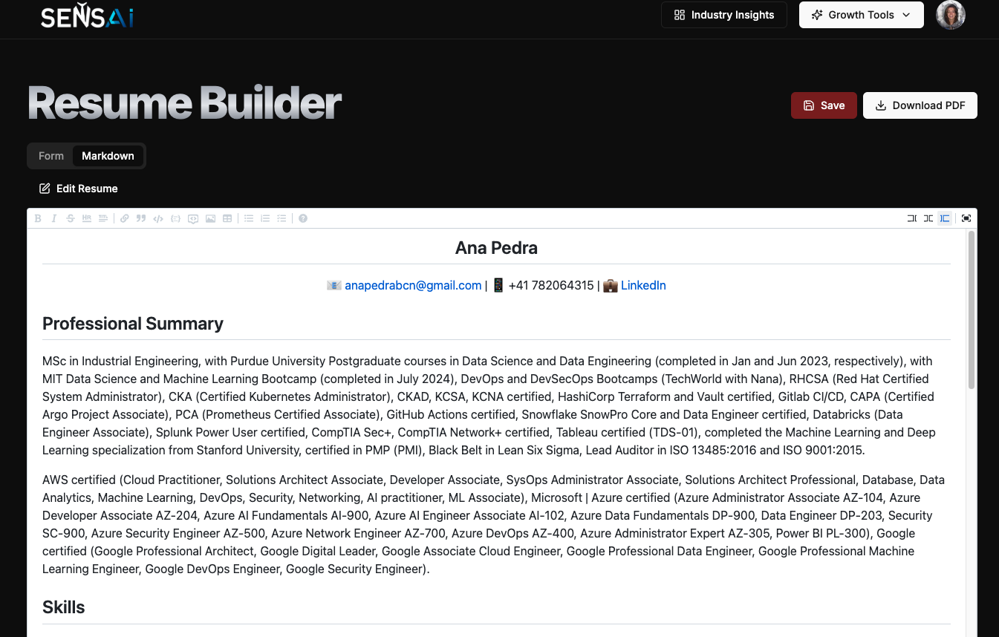
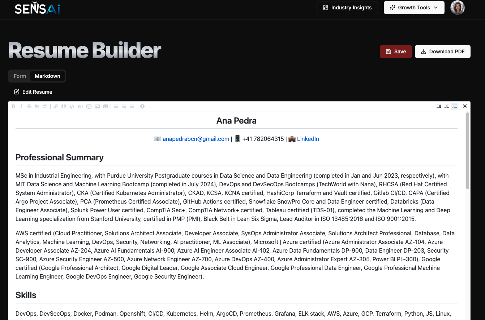
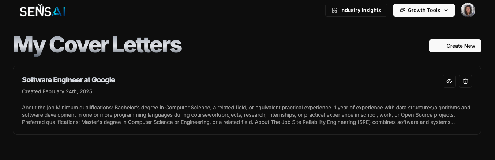
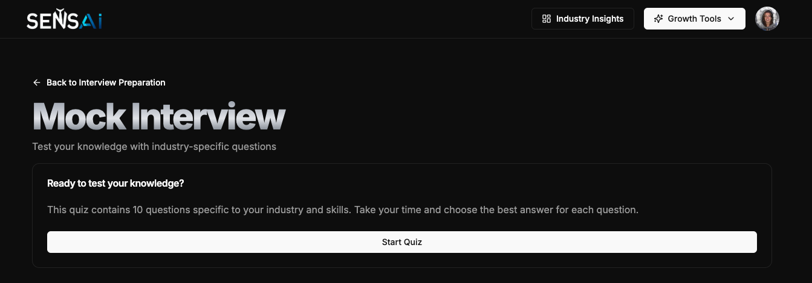

## 1. Overview

The **Full Stack AI Career Coach** is an advanced, AI-powered platform designed to guide you through your career journey. It offers tailored industry insights, dynamic resume and cover letter builders, and interactive interview preparation with quizzes. This application leverages a modern tech stack to provide an engaging and responsive user experience.

## 2. Features

- 🔒 **User Authentication:** Secure sign-up and login powered by Clerk.
- 📊 **Industry Insights Dashboard:** Access detailed market outlooks, industry growth statistics, demand analysis, top skills, salary ranges, and more.
- 📝 **Resume Builder:** Create and customize professional resumes with an intuitive interface.
- ✉️ **Cover Letter Builder:** Craft compelling cover letters using guided templates.
- 🎤 **Interview Preparation:** Engage in mock interviews and interactive quizzes to sharpen your skills.
- ⚙️ **Background Processing:** Automate tasks and data handling using Inngest.
- 📱 **Responsive Design:** Enjoy a fully responsive UI built with Tailwind CSS and Shadcn UI.

## 3. Tech Stack

- **Frontend:**
  - React 19 
  - Next.js 15 
  - Tailwind CSS 
  - Shadcn UI (custom components)
- **Backend:**
  - Next.js API Routes
  - Prisma ORM
  - NeonDB
- **Authentication:** Clerk Authentication
- **Background Jobs:** Inngest
- **AI & Data Integration:** Gemini API

## 4. Prerequisites

Before you begin, ensure you have the following installed:

- [Node.js](https://nodejs.org/) (v16 or higher)
- npm or yarn
- Git

## 5. Screenshots

Here are some screenshots of the application:

- **Screenshot 1:**  
  
- **Screenshot 2:**  
  
- **Screenshot 3:**  
  
- **Screenshot 4:**  
  
- **Screenshot 5:**  
  

## 6. Live Demo

Check out the final deployed app on Vercel:  
[https://ai-career-coach-peach.vercel.app/](https://ai-career-coach-peach.vercel.app/)
